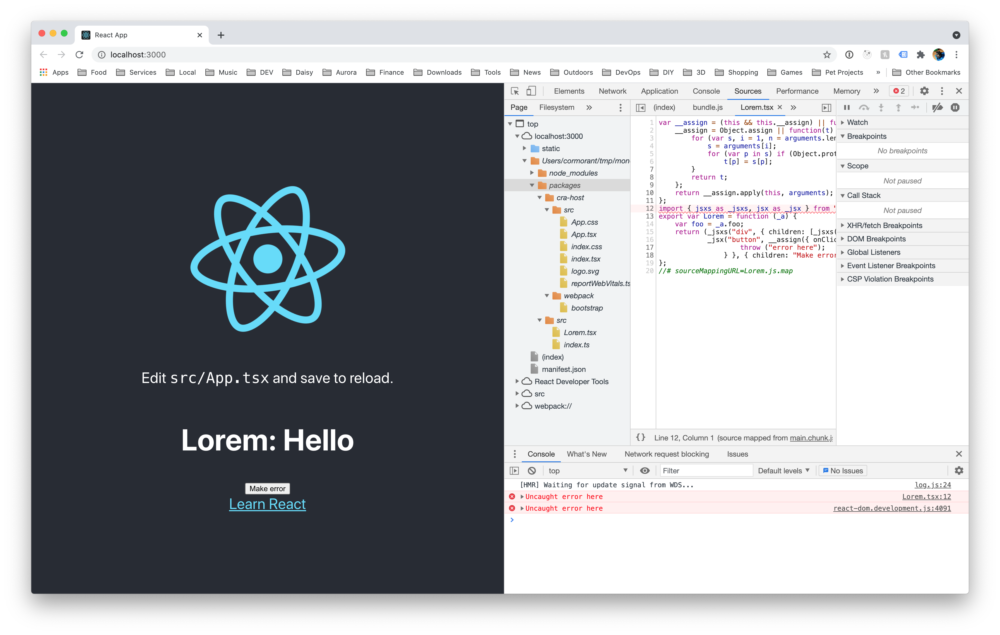

# Monorepo Sourcemaps in CRA
## Issue Example

Setup:
```
yarn
yarn workspace @akj-dev/lorem build:package
yarn workspace @akj-dev/cra-host start
```

Click "Make error"

Note the compiled code it's pointing to:


